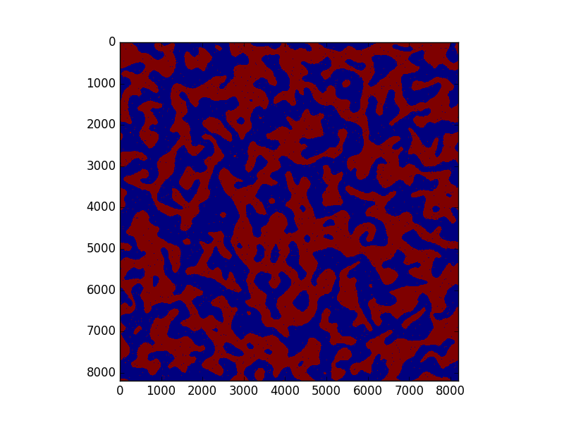

# Optimized CUDA implementation

To compile the code simply adjust the Makefile to point to your CUDA
installation and specify the CUDA architecture you want  to compile for. A
simple `make` should be enough to produce the ``cuIsing`` binary.

## Usage

<PRE>
Usage: cuIsing [options]
options:
        -x|--x &lt;HORIZ_DIM&gt;
                Specifies the horizontal dimension of the entire  lattice  (black+white  spins),
                per GPU. This dimension must be a multiple of 128.

        -y|--y &lt;VERT_DIM&gt;
                Specifies the vertical dimension of the entire lattice (black+white spins),  per
                GPU. This dimension must be a multiple of 8.

        -n|--n &lt;NSTEPS&gt;
                Specifies the number of iteration to run.
                Defualt: 1

        -d|--devs &lt;NUM_DEVICES&gt;
                Specifies the number of GPUs to use. Will use devices with ids [0, NUM_DEVS-1].
                Defualt: 1.

        -s|--seed &lt;SEED&gt;
                Specifies the seed used to generate random numbers.
                Default: 463463564571

        -a|--alpha &lt;ALPHA&gt;
                Specifies the temperature in T_CRIT units.  If both this  option  and  '-t'  are
                specified then the '-t' option is used.
                Default: 0.100000

        -t|--temp &lt;TEMP&gt;
                Specifies the temperature in absolute units.  If both this option and  '-a'  are
                specified then this option is used.
                Default: 0.226919

        -p|--print &lt;STAT_FREQ&gt;
                Specifies the frequency, in no.  of  iteration,  with  which  the  magnetization
                statistics is printed.  If this option is used together to the '-e' option, this
                option is ignored.
                Default: only at the beginning and at end of the simulation

        -e|--exppr
                Prints the magnetization at time steps in the series 0 &lt;= 2^(x/4) &lt; NSTEPS.   If
                this option is used  together  to  the  '-p'  option,  the  latter  is  ignored.
                Default: disabled

        -m|--magn &lt;TGT_MAGN&gt;
                Specifies the magnetization value at which the simulation is  interrupted.   The
                magnetization of the system is checked against TGT_MAGN every STAT_FREQ, if  the
                '-p' option is specified, or according to the exponential  timestep  series,  if
                the '-e' option is specified.  If neither '-p' not '-e' are specified then  this
                option is ignored.
                Default: unset

        -o|--o
                Enables the file dump of  the lattice  every time  the magnetization is printed.
                Default: off
</PRE>

For example, to run 128 update steps on a 65536^2 lattice using two GPUs coonected via NVLink:

<PRE>
$ ./cuIsing -y 32768 -x 65536 -n 128 -d 2 -t 1.5

Using GPUs:
         0 (Tesla V100-SXM3-32GB, 80 SMs, 2048 th/SM max, CC 7.0, ECC on)
         1 (Tesla V100-SXM3-32GB, 80 SMs, 2048 th/SM max, CC 7.0, ECC on)

GPUs direct access matrix:
          0   1
GPU  0:   V   V
GPU  1:   V   V

Run configuration:
        spin/word: 16
        spins: 4294967296
        seed: 1234
        iterations: 128
        block (X, Y): 16, 16
        tile  (X, Y): 32, 16
        grid  (X, Y): 32, 2048
        print magn. at 1st and last step
        temp: 1.500000 (0.661030*T_crit)
        temp update not set
        local lattice size:        32768 x   65536
        total lattice size:        65536 x   65536
        local lattice shape: 2 x   32768 x    2048 (   134217728 ulls)
        total lattice shape: 2 x   65536 x    2048 (   268435456 ulls)
        memory: 2048.00 MB (1024.00 MB per GPU)

Setting up multi-gpu configuration:
        GPU  0 done
        GPU  1 done

Initial magnetization:  0.000006, up_s:   2147471050, dw_s:   2147496246
Final   magnetization:  0.002735, up_s:   2141611081, dw_s:   2153356215 (iter:      128)

Kernel execution time for 128 update steps: 6.574883E+02 ms, 836.15 flips/ns (BW: 836.15 GB/s)
</PRE>

## Visualizing results

Running the code with the '-o' option enables the lattice dump at every timestep in which the
magnetization is printed on screen (depends on either the '-p' and '-e' options). The file name
has the following format:

<PRE>
lattice_&lt;LOCAL_Y&gt;x&lt;LOCAL_X&gt;_T_&lt;TEMP&gt;_IT_&lt;IT_NUMBER&gt;_&lt;GPU_ID&gt;.txt
</PRE>

The included `plotLattice.py` script allows to create an image from those output files. For example,
the following command:

<PRE>
$ ./plotLattice.py lattice_8192x8192_T_1.500000_IT_00001024_0.txt
</PRE>

will generate an image file named `lattice_8192x8192_T_1.500000_IT_00001024_0.txt.png` like:

## Contacts

For comments, questions or anything related, write to Mauro Bisson at maurob@nvidia.com.
